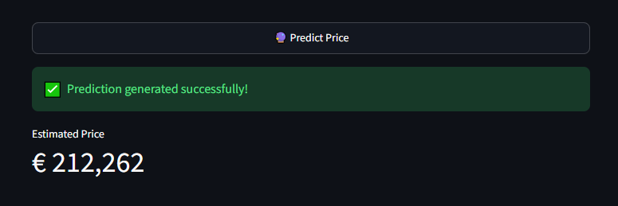

# 🏠 Immo Eliza Deployment

## 📖 Mission

This project is the deployment phase of the **Immo Eliza Machine Learning** project.

The objective is to make a trained machine learning model available through a REST API and a user-friendly web interface.

The application predicts the selling price of residential properties in Belgium using property characteristics collected from real-estate listings scraped from the Immovlan website.

The deployment includes:

- 🚀 A FastAPI backend exposing a prediction endpoint.
- 🎨 A Streamlit frontend for interactive predictions.
- 🤖 A trained XGBoost regression model.
- ✅ Automated API tests using **pytest**.
- 📊 Prediction logging and data monitoring.
- 📈 Drift detection using the **Population Stability Index (PSI)**.

---

# 🛠️ Project Architecture

```text
immo-eliza-deployment/
├── api/
│   ├── Dockerfile
│   ├── __init__.py
│   ├── app.py
│   └── predict.py
├── monitoring/
│   ├── __init__.py
│   ├── check_drift.py
│   ├── generate_logs.py
│   ├── metrics.py
│   ├── monitor.py
├── scripts/
│   ├── evaluate.py
│   └── predict_cli.py
├── src/
│   ├── __init__.py
│   ├── features.py
│   └── train.py
├── streamlit/
│   ├── Dockerfile
│   ├── __init__.py
│   └── app.py
├── tests/
│   ├── test_app.py
├── .gitignore
├── docker-compose.yml
└── requirements.txt
```

---

# 📂 File Purpose

### `api/app.py`

Defines the FastAPI application, endpoints for predictions and health checks, and validates incoming request data.

The `/ping` endpoint acts as a keep-alive monitor used by external services (UptimeRobot) to ensure the API remains active and does not fall into a sleep state.

### `api/predict.py`

Manages the prediction engine by loading the combined `pipeline.joblib` artifact (preprocessor + model) and executing inference.

### `monitoring/monitor.py`

Contains utility functions to:

- Log prediction data (`log_prediction`)
- Detect data drift using the Population Stability Index (`detect_drift`)

### `monitoring/check_drift.py`

Compares logged production predictions (`monitoring/logs.json`) against the training baseline (`data/training_baseline.csv`) and prints a per-feature PSI drift report.

### `monitoring/metrics.py`

Standalone evaluation script that loads `models/pipeline.joblib` and scores it against `data/clean/cleaned_data.json`, reporting:

- MAE
- RMSE
- MAPE
- Bias direction (over/under-estimation)
- The 3 worst individual prediction errors (it was the same results for 10)

Useful for spotting where the model struggles the most.

### `monitoring/generate_logs.py`

Generates synthetic, realistic property data (8,000 samples by default) and populates `monitoring/logs.json` to test the monitoring and drift pipeline without requiring real production traffic.

### `src/features.py`

Provides the single feature engineering pipeline (`add_features`) used to clean and format data consistently for both training and inference.

This is the source of truth: every other script (`train.py`, `evaluate.py`, `predict_cli.py`) imports this module to avoid train/inference skew.

### `src/train.py`

Handles the complete training workflow:

- Loads the cleaned dataset
- Caps outliers
- Applies feature engineering
- Fits the preprocessor and XGBoost model
- Saves three deployment artifacts:
  - `best_XGBoost.json`
  - `preprocessor.joblib`
  - `pipeline.joblib`

It also creates `data/training_baseline.csv`, which serves as the reference dataset for drift detection.

### `scripts/evaluate.py`

Loads `pipeline.joblib` and evaluates the model against `data/clean/cleaned_data.json`, reporting:

- MAE
- RMSE
- MAPE

### `scripts/predict_cli.py`

Interactive command-line interface allowing users to manually enter property characteristics and instantly obtain a price prediction from the trained pipeline.

### `streamlit/app.py`

Builds the Streamlit web interface and sends user inputs to the FastAPI backend for prediction.

### `streamlit/Dockerfile`

Defines the container environment specifically for the Streamlit application.

### `tests/test_app.py`

Contains automated tests verifying API availability and prediction correctness.

### `docker-compose.yml`

Defines and orchestrates the multi-container setup running both the FastAPI backend and the Streamlit frontend.

---

# 🚀 Running the Application

The application is available both online through deployed services and locally for development purposes.

---

## 🌍 Online Deployment

The deployed application can be accessed directly through the following links:

### 🎨 Streamlit User Interface

The Streamlit interface allows users to enter property characteristics and obtain an estimated selling price.

➡️ https://immo-eliza-deployment-sieg.streamlit.app

---

### 🚀 FastAPI Backend

The FastAPI backend provides the REST API used for predictions.

➡️ https://immo-eliza-a.onrender.com

The interactive API documentation is available through Swagger UI:

➡️ https://immo-eliza-ui.onrender.com/docs

---

# 💻 Local Execution

## 1. Clone the repository

```bash
git clone <repository-url>
cd immo-eliza-deployment


# 🛡️ Reliability & Uptime Monitoring

To ensure the application remains stable and available 24/7, the project uses three complementary reliability mechanisms.

### 🐳 Docker Orchestration

Docker manages the lifecycle of both containers.

If either the API or the Streamlit application crashes unexpectedly, Docker automatically restarts the affected container, minimizing downtime.

### ❤️ `/ping` Health Endpoint

The FastAPI application exposes a lightweight `/ping` endpoint whose only purpose is to confirm that the API is alive.

External monitoring services can call this endpoint every few minutes without placing any significant load on the application.

### 🌐 External Monitoring with UptimeRobot

Cloud providers often put free-tier applications to sleep after a period of inactivity.

UptimeRobot periodically sends requests to the `/ping` endpoint to:

- keep the application awake,
- prevent cold starts,
- ensure predictions remain immediately available.

A screenshot of the monitoring dashboard is available in:

```
tests/UptimeRobot.png
```

as proof that the monitoring system is running correctly.

> **Note**
>
> - With Docker, containers automatically restart after a crash.
> - On cloud deployments, the `/ping` endpoint is continuously polled by UptimeRobot to keep the API responsive.

---

# 🏡 Using the Application

The user fills in the property characteristics, including:

- Property type
- Location
- Living surface
- Number of bedrooms
- Construction year
- Energy consumption
- Outdoor features
- Distances to nearby facilities

After clicking **Predict Price**, the Streamlit application sends the request to the FastAPI API, which returns the estimated selling price.

---

# 🔮 Prediction Examples

The screenshots below illustrate two predictions generated by the deployed Streamlit application.

## 🏢 Example 1 – Standard Apartment

*Figure 1.*

Prediction for a standard apartment located in Brussels.

The application displays both the input characteristics and the estimated market value generated by the XGBoost model.

```md

```

---

## 🏡 Example 2 – Detached House

*Figure 2.*

Prediction for a detached house with premium features.

This example demonstrates the model's ability to estimate prices for larger and more valuable residential properties.

```md

```
# 📊 Model Performance & Monitoring

## 📈 Model Performance

The model was evaluated using `monitoring/metrics.py` on **15,746** records from `data/clean/cleaned_data.json`.

| Metric | Value |
|---------|------:|
| Total Records Evaluated | 15,746 |
| Mean Absolute Error (MAE) | **€60,831.85** |
| Root Mean Squared Error (RMSE) | **€242,698.80** |
| Mean Absolute Percentage Error (MAPE) | **16.24%** |
| Bias | Overestimating prices by **5.64%** on average |

---

## 📈 Performance Analysis

The large difference between **MAE (~€61k)** and **RMSE (~€243k)** indicates that the model performs well for most properties, while a very small number of extreme prediction errors significantly increase the RMSE.

These outliers correspond almost exclusively to **ultra-luxury properties** priced above **€8 million**, which lie far outside the distribution seen during training.

The three largest prediction errors are shown below.

| Actual Price | Predicted Price | Absolute Error |
|--------------|----------------:|---------------:|
| €8,000,000 | €833,476 | €7,166,524 |
| €8,900,000 | €940,093 | €7,959,907 |
| €8,994,000 | €175,950 | €8,818,050 |

---

## ❓ Why Removing the Hard Cap Changed Nothing

Removing the €3M hard cap had **no impact** on the evaluation metrics.

The reason is that the real limitation was never the hard cap itself:

- `load_data()` and `clean_target()` already clip prices to the **1st–99th percentile**.
- That percentile lies well below €3M.
- Consequently, the model has never seen €5M+ properties during training.

Without representative examples of luxury properties, the model simply has no basis for extrapolating accurately to this market segment.

---

# 🚀 Future Improvements

Several improvements could further increase the reliability of the deployment.

### 📊 Stratify evaluation by price tier

Instead of reporting a single MAE/RMSE/MAPE value, evaluate the model separately for:

- properties below €1M,
- properties between €1M and €3M,
- luxury properties above €3M.

This prevents a handful of extreme outliers from dominating the global metrics.

---

### 🏡 Train a dedicated luxury-property model

Testing confirmed that simply increasing `QUANTILE_UPPER` does not improve predictions for expensive properties.

A dedicated model trained specifically on luxury listings—or a significantly larger luxury dataset—would likely perform much better.

---

### ✅ Verify the evaluation dataset

Confirm whether `cleaned_data.json` represents a true held-out test set or overlaps with the training data.

This distinction has a significant impact on interpreting the reported **16.24% MAPE**.

---

# ⚠️ Known Limitations & Disclaimer

This model should be considered **an estimation tool rather than a property valuation system**.

Users should be aware of two important limitations.

## 📈 Systematic Bias

Across the evaluation dataset, the model tends to **overestimate prices by approximately 5.64%**.

Predictions should therefore be interpreted as approximate estimates rather than precise valuations.

---

## 🏰 High-End Properties

For properties priced above roughly the **99th percentile** of the training data (multi-million-euro properties), the model is forced to extrapolate far beyond the examples it has learned from.

Prediction errors of several million euros are therefore possible.

The average bias reported above **does not apply** to this segment, where errors become much larger and typically correspond to severe underestimation.

---

# 📉 Drift Analysis

Monitoring compares **8,000 synthetic production predictions** against the **10,802 samples** used during model training using `monitoring/check_drift.py`.

Data drift is measured using the **Population Stability Index (PSI)**.

---

## 🚨 Current Status

### Strong Drift Detected

| Feature | PSI | Status |
|---------|----:|:------|
| Build Year | 0.9734 | 🚨 Strong Drift |
| Bedroom Count | 0.2005 | ⚠️ Moderate |
| Livable Surface | 0.6352 | 🚨 Strong Drift |
| Total Surface | 0.0824 | ✅ Stable |
| Garage | 0.1500 | ⚠️ Moderate |
| Terrace | 0.1228 | ⚠️ Moderate |
| Swimming Pool | 0.0009 | ✅ Stable |
| Energy Consumption | 11.7938 | 🚨 Strong Drift |
| Property State (encoded) | 13.5164 | 🚨 Strong Drift |
| Property Age | 0.9734 | 🚨 Strong Drift |
| Preschool Distance | 0.5542 | 🚨 Strong Drift |
| Train Station Distance | 3.0964 | 🚨 Strong Drift |
| Supermarket Distance | 2.1613 | 🚨 Strong Drift |
| Price per m² | 0.3889 | 🚨 Strong Drift |

### 📌 Interpretation

The drift analysis reveals significant distribution changes between production and training data, especially for property characteristics and location-related features.

These observations highlight the importance of continuous monitoring and future retraining to maintain model reliability.

---

# 📈 Monitoring Interpretation

The monitoring report indicates that several important input variables have shifted substantially since the model was trained.

The strongest changes concern:

- 🏷️ Property state (encoded)
- ⚡ Energy consumption
- 🚉 Distance to train stations
- 🛒 Distance to supermarkets
- 🏗️ Build year / Property age
- 📐 Livable surface

These are among the most influential variables used by the XGBoost model.

Because their distributions have evolved, production data no longer perfectly matches the original training data.

---

## 📌 Notes About the Monitoring Report

Two observations deserve attention.

### 1. Redundant Features

`build_year` and `property_age` always produce the exact same PSI value (**0.9734**).

This is expected, so monitoring both variables is redundant.

---

### 2. Price per m²

`price_per_m2` is still monitored even though it was intentionally removed from the model's training features because it introduced target leakage.

Its PSI therefore reflects differences between production logs and the training dataset rather than changes affecting the deployed model itself.

It may still be useful as an informational metric, but it should **not** be interpreted as evidence that a model input has drifted.

---

## 📌 Overall Conclusion

Despite the detected drift, the prediction service remains fully operational and continues to return valid price estimates.

However, the observed distribution shifts suggest that prediction quality is likely to deteriorate over time.

For this reason, the monitoring component recommends retraining the model using more recent real-estate data before the next production deployment.

# 🧪 Automated Testing

Automated tests verify that both the API and the prediction pipeline behave as expected.

---

## 📦 Install Test Dependencies

```bash
pip install pytest httpx
```

---

## ▶️ Run the Tests

Execute:

```bash
pytest tests/test_app.py
```

---

## ✅ Expected Output

```text
tests/test_app.py .... [100%]
================== 4 passed ==================
```

---

## ✔️ What Is Tested?

The automated test suite validates several critical aspects of the application:

- ❤️ API availability through the health endpoint.
- 🏠 Successful prediction using valid real estate data.
- 💰 Correct numeric prediction returned by the model.
- ❌ Validation of incorrect input types.
- ⚠️ Detection of missing required fields (HTTP 422).

Passing all tests confirms that the deployed application behaves as expected.

---

# 📚 Technologies Used

| Component | Technology |
|-----------|------------|
| Machine Learning | XGBoost |
| API | FastAPI |
| Frontend | Streamlit |
| Data Validation | Pydantic |
| Testing | pytest |
| Monitoring | Population Stability Index (PSI) |
| Serialization | Joblib |
| Language | Python |

---

# 📌 Final Conclusion

This project demonstrates the complete deployment lifecycle of a machine learning regression model, from data preparation and model serving to monitoring and maintenance.

A trained **XGBoost regression model** was successfully deployed behind a **FastAPI REST API** and integrated with a **Streamlit web application**, allowing users to obtain real-time Belgian real estate price estimations based on property characteristics.

Beyond simply exposing predictions, the project implements several production-oriented practices to improve reliability and maintainability:

- 🚀 Deployment of a scalable prediction API using FastAPI
- 🎨 Development of an interactive user interface with Streamlit
- 🧪 Automated API and prediction testing with pytest
- ✔️ Input validation and error handling with Pydantic
- 📦 Model serialization and reproducible inference through a complete pipeline
- 📊 Prediction logging for future analysis
- ❤️ Availability monitoring through a dedicated health endpoint and UptimeRobot
- 📉 Data drift detection using the Population Stability Index (PSI)

The model evaluation showed that the system provides reliable predictions for the majority of residential properties. However, the analysis also highlighted the difficulty of predicting ultra-luxury properties, where limited training examples force the model to extrapolate beyond the range of data it has learned from.

The monitoring analysis demonstrated the importance of continuously tracking production data. Several feature distributions have shifted compared with the original training dataset, showing that model performance can degrade over time if the system is not regularly reviewed and updated.

These findings emphasize that deploying a machine learning model is not the final step of an ML project. A reliable production system requires continuous monitoring, automated testing, data validation, and periodic retraining to remain accurate as real-world data evolves.

Overall, this project delivers a complete end-to-end machine learning deployment pipeline, combining **data science, software engineering, and MLOps practices** to transform a trained model into a reliable and maintainable application.

---

# 👤 Author

**Siegried Camus**

Developed as part of the **BeCode AI & Data Science Bootcamp**.
