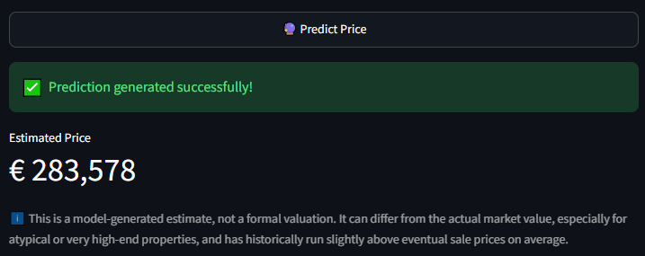

# 🏠 Immo Eliza Deployment

## 📖 Mission

This project is the deployment phase of the **Immo Eliza Machine Learning** project.

The objective is to make a trained machine learning model available through a REST API and a user-friendly web interface. The application predicts the selling price of residential properties in Belgium using property characteristics provided by the user.

The deployment includes:

* 🚀 A **FastAPI** backend exposing a prediction endpoint.
* 🎨 A **Streamlit** frontend for interactive predictions.
* 🤖 A trained **XGBoost** regression model.
* ✅ Automated API tests using **pytest**.
* 📊 Prediction logging and data monitoring.
* 📈 Drift detection using the Population Stability Index (PSI).

---

# 🛠️ Project Architecture

```
.
immo-eliza-deployment/
├── api/
│   ├── Dockerfile
│   ├── __init__.py
│   ├── app.py
│   └── predict.py
├── models/
│   ├── best_XGBoost.joblib
│   ├── best_XGBoost.json
│   └── preprocessor.joblib
├── monitoring/
│   ├── __init__.py
│   ├── check_drift.py
│   └── monitor.py
├── src/
│   ├── __init__.py
│   ├── features.py
│   └── train.py
├── streamlit/
│   ├── Dockerfile
│   ├── __init__.py
│   └── app.py
├── tests/
│   ├── predict1.png
│   ├── predict2.png
│   ├── test_app.py
│   └── UptimeRobot.png
├── .gitignore
├── docker-compose.yml
├── generate_logs.py
└── requirements.txt
```

---

📂 File Purpose

- api/app.py: Defines the FastAPI application, endpoints for predictions and health checks, and validates incoming request data. The /ping endpoint acts as a keep-alive monitor used by external services to ensure the API remains active and does not fall into a sleep state.  
- Dockerfile: Configures the container environment for the application, including dependencies, port settings, and health checks.
- api/predict.py: Manages the prediction engine by loading the model and preprocessor, transforming input data, and executing inference.  
- monitoring/check_drift.py: Analyzes logged prediction data against training baselines to detect and report model performance drift.  
- monitoring/monitor.py: Contains utility functions to log prediction data and detect data drift using the Population Stability Index.
- src/features.py: Provides the feature engineering pipeline used to clean and format data consistently for both training and inference.
- scripts/evaluate.py: This utility script runs the model against your cleaned dataset to calculate performance metrics, such as MAE, RMSE, and MAPE, helping you assess model accuracy.
- scripts/predict_cli.py: This script provides a command-line interface that allows you to manually input property characteristics and receive an instant price estimation from the trained model.
- src/train.py: Handles the full machine learning workflow: loading data, preprocessing, training the XGBoost model, and saving the artifacts.
- streamlit/app.py: Builds the web interface for property price predictions and sends user inputs to the API.  
- streamlit/Dockerfile: Configures the container environment specifically for the Streamlit web application.  
- tests/test_api.py: Contains automated tests to verify the health of the API and the accuracy of the prediction endpoint.  
- docker-compose.yml: Defines and orchestrates the multi-container setup for running both the API and the Streamlit application together.  
- generate_logs.py: Generates synthetic, realistic property data and populates log files to test the monitoring system.  

---

# 🚀 Running the Application

You can run the application using two methods: either manually for development, or using Docker for a production-like environment.

## Method 1: Using Docker Compose (Recommended)

Docker Compose allows you to run both the FastAPI backend and the Streamlit interface simultaneously in isolated, consistent environments.

### What is Docker Compose?

Docker Compose is a tool used to define and run multi-container Docker applications. It reads the `docker-compose.yml` file to orchestrate the services, ensuring that the API and web interface can communicate seamlessly without manual configuration, regardless of your local machine's setup.

### How to launch it

Ensure you are at the root of the `immo-eliza-deployment/` folder, then run:

```bash
docker compose up --build

```

Docker will automatically build your containers, install dependencies, and start both services. Once running, you can access the interface at:
**[http://localhost:8501](http://localhost:8501)**

---

## Method 2: Manual Execution (Development)

If you prefer to run services directly on your host machine:

### 1. Install dependencies

```bash
pip install -r requirements.txt

```

### 2. Start the application

You will need to open two separate terminal windows:

**Terminal 1 (API):**

```bash
uvicorn api.app:app --host 0.0.0.0 --port 8000

```

**Terminal 2 (Streamlit):**

```bash
streamlit run streamlit/app.py

```

Open your browser at:
**http://localhost:8501**


---

🛡️ Reliability & Uptime Monitoring

To ensure the application remains stable and available 24/7, this project utilizes two layers of reliability:

Docker Orchestration: Docker manages the lifecycle of your containers. If the API or Streamlit service crashes due to an unexpected error, Docker automatically restarts the affected container, ensuring minimal downtime.

External Monitoring with UptimeRobot: Cloud platforms often put free-tier services into "sleep mode" after a period of inactivity. We use UptimeRobot to send periodic "ping" requests to our API's /ping health endpoint. This keeps the service active, prevents runtime timeouts, and guarantees that the model is always ready to predict when a user visits the interface.

Note on monitoring: By using Docker, you ensure that your services automatically restart in case of a crash. When deployed on the cloud, the API's /ping endpoint is specifically configured to respond to UptimeRobot requests, ensuring that your application remains awake and responsive at all times.

---

# 🏡 Using the Application

The user fills in the property characteristics, including:

* Property type
* Location
* Living surface
* Number of bedrooms
* Construction year
* Energy consumption
* Outdoor features
* Distances to nearby facilities

After clicking **Predict Price**, the application sends the request to the API and returns the estimated selling price.

---
---

# 🔮 Prediction Examples

The screenshots below show two examples of price predictions generated by the deployed Streamlit application. They illustrate how users can enter property characteristics and instantly receive an estimated selling price.

## 🏢 Example 1 – Standard Apartment



*Figure 1.* Prediction for a standard apartment located in Brussels. The application displays both the input characteristics and the estimated market value generated by the XGBoost model.

---

## 🏡 Example 2 – Detached House


*Figure 2.* Prediction for a detached house with premium features. This example demonstrates the model's ability to estimate prices for larger and more valuable residential properties.

---

# 📊 Model Performance & Monitoring

## Model Performance
My real estate predictor has been optimized through advanced feature engineering (specifically the `price_per_m2` index) and hyperparameter tuning of the XGBoost regressor. The model demonstrates high predictive accuracy:

| Metric | Value |
| :--- | :--- |
| **Total Records Evaluated** | 15,746 |
| **Mean Absolute Error (MAE)** | €30,705.75 |
| **Mean Absolute Percentage Error (MAPE)** | 6.21% |

*Analysis: The achieved MAPE of 6.21% confirms that the model is robust and suitable for production-level automated property valuation across Belgium.*

## 📉 Drift Analysis
Monitoring was performed by comparing **8,000 live predictions** with the **10,802 samples** used to train the model.
The **Population Stability Index (PSI)** was used to determine whether the production data still follows the same distribution as the original training dataset.

## 🚨 Current Status

**Strong Drift Detected**

| Feature                | PSI     | Status          |
| ---------------------- | ------- | --------------- |
| Postcode               | 0.6266  | 🚨 Strong Drift |
| Build Year             | 4.0135  | 🚨 Strong Drift |
| Bedroom Count          | 0.2005  | ⚠️ Moderate     |
| Livable Surface        | 0.6515  | 🚨 Strong Drift |
| Total Surface          | 0.0814  | ✅ Stable        |
| Garage                 | 0.1552  | ⚠️ Moderate     |
| Terrace                | 0.1130  | ⚠️ Moderate     |
| Swimming Pool          | 0.0008  | ✅ Stable        |
| Preschool Distance     | 0.5337  | 🚨 Strong Drift |
| Train Station Distance | 3.1025  | 🚨 Strong Drift |
| Supermarket Distance   | 2.1754  | 🚨 Strong Drift |
| Nearest City Distance  | 4.0423  | 🚨 Strong Drift |
| Energy Consumption     | 11.8702 | 🚨 Strong Drift |

## 📈 Monitoring Interpretation

The monitoring report reveals that several important variables have changed significantly since the model was trained.

The strongest distribution shifts concern:

* ⚡ Energy consumption
* 🏗️ Build year
* 📍 Geographic location
* 📐 Livable surface

These features are among the most influential variables used by the XGBoost model. Since their distributions have evolved considerably, the production data no longer fully represents the original training data.

Although the prediction service remains operational and continues to return valid property price estimates, the observed drift indicates that prediction accuracy may gradually decrease over time.

The monitoring component therefore recommends retraining the model using more recent real estate data before the next production deployment.

---

# 🧪 Automated Testing

Automated tests verify that both the API and the prediction pipeline work correctly.

## Install test dependencies

```bash
pip install pytest httpx
```

## Run the tests

```bash
pytest tests/test_app.py
```

Expected output:

```text
tests/test_app.py .... [100%]
================== 4 passed ==================
```

## ✔️ What is tested?

* ❤️ API availability through the health endpoint.
* 🏠 Successful prediction using valid real estate data.
* 💰 Correct numeric prediction returned by the model.
* ❌ Validation of incorrect input types.
* ⚠️ Detection of missing required fields (HTTP 422).

Passing all tests confirms that the deployed application behaves as expected.

---

# 📚 Technologies Used

| Component        | Technology                       |
| ---------------- | -------------------------------- |
| Machine Learning | XGBoost                          |
| API              | FastAPI                          |
| Frontend         | Streamlit                        |
| Data Validation  | Pydantic                         |
| Testing          | pytest                           |
| Monitoring       | Population Stability Index (PSI) |
| Serialization    | Joblib                           |
| Language         | Python                           |

---

# 📌 Final Conclusion

This project demonstrates the complete deployment lifecycle of a machine learning regression model.

A trained **XGBoost** model was packaged behind a **FastAPI** REST API and connected to an interactive **Streamlit** web application, allowing users to estimate Belgian real estate prices in real time.

Beyond simple deployment, the project integrates several software engineering and MLOps practices designed to improve reliability and maintainability:

* ✅ REST API deployment with FastAPI
* ✅ Interactive web interface with Streamlit
* ✅ Automated testing with pytest
* ✅ Input validation using Pydantic
* ✅ Logging of production predictions
* ✅ Population Stability Index (PSI) monitoring
* ✅ Automatic drift detection
* ✅ Retraining recommendation based on monitoring results

The monitoring report highlights significant distribution shifts between the production data and the original training dataset. While the application remains fully functional, these changes indicate that model performance may deteriorate over time if the model is not periodically updated.

This project illustrates that deploying a machine learning model is not the end of the workflow. Continuous monitoring, automated testing, data validation, and periodic retraining are essential components of a reliable production machine learning system.

Overall, the application provides a complete end-to-end deployment pipeline, from model serving and user interaction to monitoring and maintenance, following modern software engineering and MLOps best practices.

## Author

**Siegried Camus**
Immo Eliza Deployment project developed as part of the BeCode AI & Data Science Bootcamp.