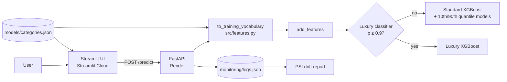
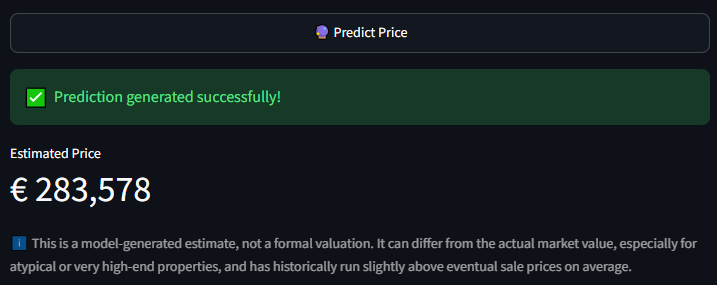
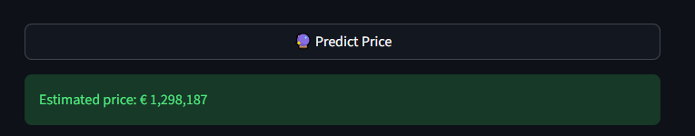

# 🏠 Immo Eliza Deployment

Deployment phase of the **Immo Eliza Machine Learning** project: a REST API + web interface that predicts Belgian residential property prices, with a dedicated luxury-segment model for high-end properties.

- 🚀 FastAPI backend + 🎨 Streamlit frontend
- 🤖 XGBoost regression, with a luxury-segment model + routing classifier
- ✅ Automated pytest suite (31 tests, API and UI, no network)
- 📊 Prediction logging, PSI-based drift detection
- 🔎 Audited end to end: [10 bugs found and fixed](#-bugs-found-and-fixed), including one that made the model ignore property type and province and a luxury model that always answered €1.9M

---

## 📑 Table of Contents

1. [Project Architecture](#-project-architecture)
2. [Bugs Found and Fixed](#-bugs-found-and-fixed)
3. [File Purpose](#-file-purpose)
4. [Running the Application](#-running-the-application)
5. [Reliability & Uptime Monitoring](#-reliability--uptime-monitoring)
6. [Using the Application](#-using-the-application)
7. [Prediction Examples](#-prediction-examples)
8. [Model Performance & Monitoring](#-model-performance--monitoring)
9. [Luxury Routing](#-luxury-routing)
10. [Known Limitations & Disclaimer](#-known-limitations--disclaimer)
11. [Drift Analysis](#-drift-analysis)
12. [Automated Testing](#-automated-testing)
13. [Future Improvements](#-future-improvements)
14. [Technologies Used](#-technologies-used)
15. [Conclusion](#-conclusion)

---

## 🛠️ Project Architecture


```mermaid
flowchart LR
    U[User] --> S[Streamlit UI<br/>Streamlit Cloud]
    S -- POST /predict --> A[FastAPI<br/>Render]
    A --> N[to_training_vocabulary<br/>src/features.py]
    N --> F[add_features]
    F --> C{Luxury classifier<br/>p ≥ 0.9?}
    C -- no --> M1[Standard XGBoost<br/>+ 10th/90th quantile models]
    C -- yes --> M2[Luxury XGBoost]
    A --> L[(monitoring/logs.json)]
    L --> D[PSI drift report]
    V[(models/categories.json)] --> N
    V --> S
```

```text
immo-eliza-deployment/
├── api/
│   ├── __init__.py
│   ├── app.py               # FastAPI app, request validation, luxury routing
│   ├── Dockerfile
│   └── predict.py            # Loads model artifacts, runs inference
├── data/
├── models/                    # pickled pipelines + categories.json (training vocabulary)
├── monitoring/
│   ├── __init__.py
│   ├── check_drift.py         # PSI drift report vs. training baseline
│   ├── generate_logs.py       # Synthetic logs for testing the monitoring pipeline
│   ├── metrics.py             # True-holdout evaluation, by price tier
│   └── monitor.py             # log_prediction(), PSI computation
├── scripts/
│   ├── evaluate_stratified.py  # Sweeps the luxury-routing threshold, per tier
│   ├── export_categories.py    # Writes models/categories.json after each retraining
│   └── predict_cli.py
├── src/
│   ├── __init__.py
│   ├── features.py            # Single source of truth for feature engineering
│   ├── optimize.py            # Optuna hyperparameter search
│   └── train.py               # Full training workflow (standard + luxury + routing + quantile models)
├── streamlit/
│   ├── app.py
│   └── Dockerfile
├── tests/
│   ├── conftest.py            # disables prediction logging during tests
│   ├── test_app.py
│   ├── test_predict.py        # vocabulary mapping + real-model behaviour
│   └── test_streamlit_app.py  # UI through Streamlit's AppTest, API mocked
├── .streamlit/config.toml     # UI theme
├── .dockerignore
├── .gitignore
├── docker-compose.yml
├── README.md
└── requirements.txt
```

> `scripts/evaluate_stratified.py` reports metrics **per price tier** and sweeps the luxury-routing threshold — replaces the old global-metric `evaluate.py`.

---

## 📂 File Purpose

| File | Purpose |
|---|---|
| `api/app.py` | FastAPI endpoints, request validation, luxury routing decision (via `luxury_threshold.json`), `/ping` keep-alive for UptimeRobot |
| `api/predict.py` | Loads the 5 model artifacts (standard, luxury, luxury classifier, lower/upper quantile) and runs inference |
| `monitoring/monitor.py` | Logs predictions, computes PSI drift |
| `monitoring/check_drift.py` | Compares logs vs. training baseline, prints PSI report |
| `monitoring/metrics.py` | Scores `pipeline.joblib` on `train.py`'s **validation split**, overall and by price tier |
| `monitoring/generate_logs.py` | Generates synthetic logs to test the monitoring pipeline |
| `src/features.py` | Single source of truth for feature engineering — imported by every script to prevent train/inference skew. `to_training_vocabulary()` rewrites user input into the exact category strings the models were fitted on |
| `models/interval_calibration.json` | Conformal margin applied to the price range, with the coverage measured before and after on held-out rows |
| `models/categories.json` | Provinces, cities (with training row counts), property types and states the models know; read by the API and the UI |
| `scripts/export_categories.py` | Regenerates `models/categories.json` from the training split |
| `src/train.py` | Full training workflow: cleans data, caps outliers, trains standard model, luxury model, routing classifier, and quantile (interval) models; writes `luxury_threshold.json`. Deterministic: two runs give identical models. `TEST_SIZE`/`SPLIT_SEED` are shared with the evaluation scripts |
| `src/optimize.py` | Optuna hyperparameter search for the standard model |
| `scripts/evaluate_stratified.py` | Evaluates the full routing pipeline per price tier across routing thresholds, on the validation split — used to choose the 0.9 threshold |
| `scripts/predict_cli.py` | CLI for manual predictions |
| `streamlit/app.py` | Web UI: choice lists from `categories.json`, estimate with its likely range, price per m², segment badge, caveats and a history of recent estimates |
| `tests/` | API, vocabulary mapping, real-model behaviour and UI tests (see [Automated Testing](#-automated-testing)) |
| `docker-compose.yml` | Orchestrates API + Streamlit containers |

> **Legacy note:** `pipeline.joblib` now bundles preprocessor + model in one `sklearn.Pipeline`, replacing the old separate `best_XGBoost.json` / `preprocessor.joblib` files.

---

## 🔎 Bugs Found and Fixed

An end-to-end audit of the deployed service (not just the notebook metrics) found these issues:

| # | Problem | Impact | Fix |
|---|---|---|---|
| 1 | The UI sent `HOUSE`, `Liège`, `TO_RENOVATE`; the TargetEncoder was fitted on `house`, `liege`, `TO RENOVATE`. Unseen strings fall back to the global mean. | **The model ignored property type, province and condition.** A house and an apartment with the same inputs got the exact same price, and "to renovate" was priced above "normal". | `to_training_vocabulary()` maps every spelling (English/French/Dutch, any case, accents) to the training value; unknown categories return 422. Tests pin "house ≠ apartment", "to renovate < normal", "Walloon Brabant > Liège". |
| 2 | Optional fields defaulted to `0`, a value that never appears in training for plot surface or distances (they were missing and imputed instead). | Out-of-distribution input: about **+14%** on a typical Liège house. | Optional fields default to *missing* and are imputed exactly as in training; a plot surface of 0 is read as unknown. |
| 3 | `requirements.txt` did not pin the libraries the models were pickled with. | A fresh install (Render, Streamlit Cloud) gets `category_encoders` ≥ 2.10 and every prediction fails with `AttributeError`. | Pinned `scikit-learn==1.9.0`, `xgboost==3.2.0`, `category_encoders==2.8.1` (versions read from the pickles). |
| 4 | `docker-compose.yml` was UTF-16, mapped `8000:1000`, mounted `./api` over `/app` (hiding `src/`, `monitoring/`, `models/`) and never told the UI where the API was. | `docker compose up` could not work. | Rewritten: correct ports, no source volumes, `API_URL=http://api:8000`, restart policy. Dockerfiles read Render's `$PORT`. |
| 5 | `streamlit/app.py` had a broken indentation (`try:` at column 0), and an empty `streamlit/__init__.py` shadowed the `streamlit` library whenever the repo root was on `sys.path`. | The UI crashed on start. | New UI; the stray package file is removed. |
| 6 | The price range comes from the standard-segment quantile models but was returned next to luxury-model prices. | A range describing a different estimate. | The range is only returned for the standard segment. |
| 7 | `src/train.py` clipped prices at the 99th percentile, then trained the luxury regressor on rows *above* that same percentile. | Every luxury target was €1.9M: **the luxury model answered €1.9M for every property**, so a 400 m² Brussels house jumped from ~€640k (300 m²) to €1.9M. | The luxury regressor is trained on unclipped prices. A test fails if it ever becomes constant again. |
| 8 | The "true holdout" in `metrics.py` and `evaluate_stratified.py` (rows absent from `training_baseline.csv`) still contained 3,938 of its 4,944 rows from the training split, including 23 of the 29 €3M+ properties. | Metrics were optimistic (16.8% MAPE instead of 22.4%) and rewarded memorisation, so the routing threshold was tuned on training data. | Both scripts score `train.py`'s validation split (3,150 rows no model was fitted on); the threshold was re-chosen there (0.7 → 0.9). |
| 9 | The committed `pipeline.joblib` could not be reproduced by `src/train.py`. | No way to know how the deployed model was built. | All five artifacts are retrained by `src/train.py` (same validation MAPE: 22.42% → 22.39%) and two runs give identical models. |
| 10 | The "80%" price range (10th–90th percentile models) held the real price only ~71% of the time on unseen listings. | Users were told the range was more reliable than it is. | Conformalized quantile regression: `train.py` widens both bounds by a margin computed on half of the validation split and measures the result on the other half (70.4% → 77.6%; 79.9% on average over 200 random halvings). |

Tests also wrote every request into `monitoring/logs.json`, polluting the drift report; logging is now disabled in tests.

---

## 🚀 Running the Application

### 🌐 Live Deployment

- **Web App (Streamlit Community Cloud):** https://immo-eliza-deployment-sieg.streamlit.app
- **API (Render):** https://immo-eliza-ui.onrender.com
- **API Docs (Swagger UI):** https://immo-eliza-ui.onrender.com/docs

### Method 1 — Docker Compose (recommended)

```bash
docker compose up --build
```

App available at `http://localhost:8501`.

### Method 2 — Manual (development)

Python 3.12 recommended (the pinned scikit-learn needs ≥ 3.11).

```bash
pip install -r requirements.txt
uvicorn api.app:app --host 0.0.0.0 --port 8000     # terminal 1
streamlit run streamlit/app.py                      # terminal 2
```

### Method 3 — Retrain & re-evaluate

```bash
python src/train.py                     # trains all 5 artifacts (deterministic)
python scripts/export_categories.py     # refreshes models/categories.json
python scripts/evaluate_stratified.py   # sweeps the luxury-routing threshold on the validation split
python monitoring/metrics.py            # standard-model metrics by tier on the validation split
```

---

## 🛡️ Reliability & Uptime Monitoring

- **Docker** auto-restarts either container on crash.
- **`/ping`** endpoint: lightweight liveness check.
- **UptimeRobot** polls `/ping` to prevent cold starts on free-tier hosting (see `tests/UptimeRobot.png`).

---

## 🏡 Using the Application

1. Pick the province, then the city: only cities present in the training data are offered, and the UI warns when a city has fewer than 20 listings (the target encoder then leans on the province).
2. Describe the property. Garage and terrace are yes/no, as in the training data. Leave the plot surface at 0 if unknown, and the energy consumption off if unknown: both are then estimated as during training.
3. Click **Estimate**. You get the price, its likely range, the price per m², the luxury probability and the caveats that apply. The last five estimates stay visible for comparison.

The sidebar shows whether the API is awake: on Render's free tier the first call after a pause can take up to a minute.

---

## 🔮 Prediction Examples

> These screenshots show the **previous** UI, before bug #1 was fixed: the prices below were computed while the model ignored property type, province and condition, and will differ with the current version.

**Example 1 — Standard property:**



Estimated price: **€283,578**

**Example 2 — Higher-value property:**



Estimated price: **€1,449,607**

---

## 📊 Model Performance & Monitoring

All figures are measured on `train.py`'s **validation split**: 3,150 listings no model was fitted on (the standard model uses it for early stopping only). Earlier versions of this README reported 16.83% MAPE on a "holdout" that turned out to contain 80% training rows (bug #8); the numbers below are the real ones.

**Standard model alone** (`monitoring/metrics.py`):

| Metric | Value |
|---|---:|
| MAE | €92,025 |
| RMSE | €225,202 |
| MAPE | 22.39% |
| Bias | +4.90% (overestimation) |

| Tier | N | MAE | MAPE |
|---|---:|---:|---:|
| < €1M | 3,005 | €67,092 | 21.94% |
| €1M–€1.9M | 110 | €376,244 | 27.40% |
| €1.9M+ | 35 | €1,339,442 | 44.99% |

The standard model is trained on prices clipped to the 1st–99th percentile (€1.9M at the top), so it cannot predict above that: the worst errors are €5M–€6.5M properties predicted under €2M. That is what the luxury model is for.

**Prediction interval:** standard-segment predictions come with a 10th–90th percentile range from two extra `XGBRegressor` models (`objective="reg:quantileerror"`), returned as `prediction_interval: {lower, upper}`. The raw models were too narrow: on unseen listings they held the real price only ~71% of the time. `train.py` now calibrates them with **conformalized quantile regression** (CQR): on half of the validation split (standard-routed rows, real unclipped prices) it finds the log-scale margin that makes 80% of prices fall inside, saves it to `models/interval_calibration.json`, and the API widens both bounds by it (currently ×1.05 / ÷1.05). On the other half, never used to set the margin, coverage goes from 70.4% to 77.6%; over 200 random halvings it averages 79.9% (5th–95th percentile: 77.5%–82.1%). Not available for the luxury segment (too few rows for a stable quantile fit).

---

## 🏛️ Luxury Routing

A routing classifier estimates whether a property is in the top 1% of prices (above €1.9M); above the routing threshold, a dedicated luxury regressor trained on those ~125 listings prices it instead of the standard model.

Validation split, by tier (`scripts/evaluate_stratified.py`):

| Routing | Overall MAPE | < €1M | €1M–€1.9M | ≥ €1.9M (35) | Rows routed |
|---|---:|---:|---:|---:|---:|
| No routing | 22.4% | 21.9% | 27.4% | 45.0% (bias −45%) | 0 |
| Threshold 0.7 | 26.0% | 25.0% | 49.9% | 29.6% | 80 |
| **Threshold 0.9 (chosen)** | **22.9%** | **22.3%** | **36.2%** | **34.3%** | **42** |
| Threshold 0.95 | 22.5% | 22.0% | 32.2% | 38.3% | 24 |

**Why 0.9:** the classifier is trained with `scale_pos_weight ≈ 99`, which inflates its probabilities. At 0.7, 80 properties were routed but only 23 were really above €1.9M; the other 57 received a luxury price of at least ~€1.95M. At 0.9 the luxury tier error drops from 45% to 34% while the < €1M tier barely moves (21.9% → 22.3%). The cost is the €1M–€1.9M tier (27% → 36%), where the classifier still sends some properties to the luxury model.

---

## ⚠️ Known Limitations & Disclaimer

This is an **estimation tool, not a valuation system**.

- **Accuracy:** about 22% average error on listings never seen in training (≈ €67k below €1M), with prices overestimated by about 5% on average.
- **High-end properties (€1.9M+):** the luxury model learned from ~125 listings; expect errors around a third of the price, typically underestimation.
- **Routing trade-off:** routing helps the luxury tier but costs accuracy between €1M and €1.9M (see [Luxury Routing](#-luxury-routing)).
- **Range:** calibrated to hold the real price 8 times in 10 on average; for a given property it can be wide (median width ≈ €210k).
- **City names:** the training data mostly uses one language per city (e.g. *Elsene*, not *Ixelles*). A city name outside that list is accepted but ignored, and the API says so in `notes`.

These limitations are documented here and surfaced in the Streamlit app as a disclaimer next to each prediction, plus a flag when routed to the luxury model.

---

## 📉 Drift Analysis

`monitoring/check_drift.py` compares 8,000 synthetic production predictions against the 10,802-sample training set using PSI, on 12 monitored features.

| Feature | PSI | Status |
|---|---:|:---|
| Build Year | 0.9737 | 🚨 Strong |
| Bedroom Count | 0.2005 | ⚠️ Moderate |
| Livable Surface | 0.6399 | 🚨 Strong |
| Total Surface | 0.0824 | ✅ Stable |
| Garage | 0.1415 | ⚠️ Moderate |
| Terrace | 0.1049 | ⚠️ Moderate |
| Swimming Pool | 0.0003 | ✅ Stable |
| Energy Consumption | 11.7287 | 🚨 Strong |
| Property State (encoded) | 13.3866 | 🚨 Strong |
| Preschool Distance | 0.5430 | 🚨 Strong |
| Train Station Distance | 3.0922 | 🚨 Strong |
| Supermarket Distance | 2.1685 | 🚨 Strong |

> `property_age` and `price_per_m2` are intentionally **not** monitored: `property_age` is a deterministic function of `build_year` (same PSI, redundant signal), and `price_per_m2` was excluded from the model's training features entirely (to avoid target leakage), so it isn't a meaningful drift signal for this model.

**Interpretation:** 7 of 12 monitored features show strong drift (property state, energy consumption, all three distance features, build year, livable surface), so production data no longer matches the training distribution well. The service still runs and returns valid predictions, but retraining on more recent data is recommended.

---

## 🧪 Automated Testing

```bash
pip install pytest httpx
pytest
```

Expected: `31 passed`, offline (the UI tests mock the API; prediction logging is disabled).

- `test_app.py`: health check, valid prediction, invalid postcode (422).
- `test_predict.py`: vocabulary mapping (aliases, idempotence, unknown and rare cities, unknown categories), real-model behaviour (house ≠ apartment, province and condition move the price, the luxury model is not constant), luxury responses without a range, 422 on unknown province, conformal margin reaching its target coverage and applied by the engine.
- `test_streamlit_app.py`: the UI sends training-vocabulary values, renders the price and range, updates cities with the province, handles luxury, 422 and unreachable-API cases, and starts the way Streamlit Cloud runs it.

---

## 🚧 Future Improvements

- **Calibrate the routing classifier** (or blend both models with its probability) instead of a hard threshold, to reduce the jump between the standard and luxury models.
- **Fix `STATE_MAPPING`**: it uses `TO_RENOVATE` while the data has `TO RENOVATE`, so `property_state_encoded` was 3 ("normal") for every multi-word state during training. The categorical `property_state` column still carries the information; fixing the mapping needs a retraining.
- **City aliases** (Ixelles/Elsene, Uccle/Ukkel…) in `categories.json`, so French and Dutch names both reach the encoder.
- **Retrain on recent data**: 7 of 12 monitored features show strong drift.

---

## 📚 Technologies Used

XGBoost · scikit-learn · category_encoders · FastAPI · Streamlit · Pydantic · pytest · Docker · PSI monitoring · Joblib · Python

---

## 📌 Conclusion

This project turns a trained price model into a working service. An XGBoost model handles most predictions, while a second model and a routing classifier take over for luxury properties, using a threshold picked after testing different price tiers. Each prediction now comes with a range (not just one number), so users can see how uncertain the estimate is.

Along the way, several real bugs were found and fixed: a mismatch between a stored price and a probability that quietly turned off the luxury model, an indexing bug that mixed up rows after splitting the data, and a test set that overlapped too much with the training data, making early results look better than they really were. A later end-to-end audit of the deployed service found more: the API spelled categories differently from the training data (so the model ignored property type and province), the luxury model always answered €1.9M, and the evaluation "holdout" still contained most training rows. With those fixed and every model reproducible from `train.py`, the honest figures are 22.9% average error overall on unseen listings, 22% below €1M and 34% for €1.9M+ properties.

The monitoring tools complete the picture. Drift detection checks whether new data still looks like the training data (right now, 7 out of 12 features show strong drift), and the evaluation script tracks whether the routing decision is still working well over time. This tool does not replace a real estate expert — the app says so clearly — but it gives a solid base to keep the model useful and trustworthy after deployment.

---

## 👤 Author

**Siegried Camus**

Developed as part of the **BeCode AI & Data Science Bootcamp**.
